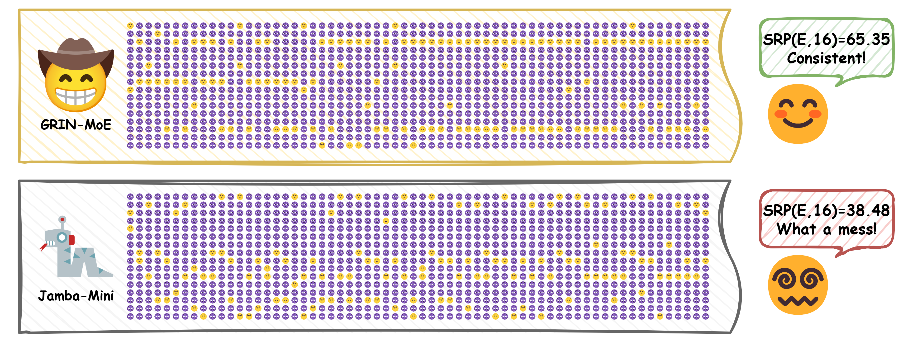

# Not All Models Suit Expert Offloading: On Local Routing Consistency of Mixture-of-Expert Models

This is the codebase for:
<center><i><u>Not All Models Suit Expert Offloading:</u>

On <b>Local Routing Consistency</b> of Mixture-of-Expert Models</i>

[[📄Paper](https://arxiv.org/abs/2505.16056)] • [[💻Code](https://github.com/ljcleo/moe-lrc)]</center>



## Requirements

Setup a virtual environment with Python 3.13, and run `pip install -e requirements.txt` to install dependencies. You will also need [scattermoe](https://github.com/shawntan/scattermoe) and [smoe](https://github.com/OpenSparseLLMs/LLaMA-MoE-v2) to run LLaMA-MoE-v2.

## Usage

1. **[Download raw data files](data/README.md)**
2. **[Download model files](model/README.md)**
3. **[Run scripts and notebooks!](src/README.md)**

## Cite

```{bibtex}
@misc{liang2025modelssuitexpertoffloading,
      title={Not All Models Suit Expert Offloading: On Local Routing Consistency of Mixture-of-Expert Models}, 
      author={Jingcong Liang and Siyuan Wang and Miren Tian and Yitong Li and Duyu Tang and Zhongyu Wei},
      year={2025},
      eprint={2505.16056},
      archivePrefix={arXiv},
      primaryClass={cs.LG},
      url={https://arxiv.org/abs/2505.16056}, 
}
```
